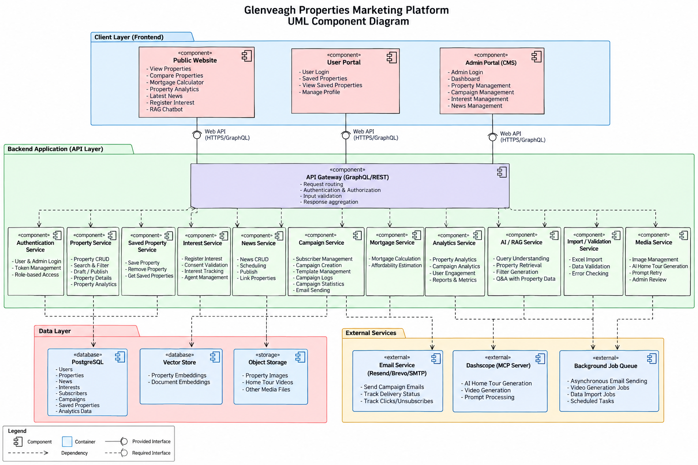

Project: Glenveagh Properties Coding Challenge

Problem Statement: Build a small marketing platform for a fictional housing development. It has three connected parts: a public marketing website, a custom content management system (CMS) that powers it, and a simple email campaign tool for announcing updates to subscribers.

User POV:
1. To view properties
2. To submit your interest - store data consent - validation
3. Calculate your mortgage
4. Comparison of properties
5. Data analytics based upon property value growth
6. Save properties and view the list of saved properties
7. RAG chatbot
    - Handles complex queries and adjusts the filters accordingly for select queries
    - Answers doubts regarding any properties based upon the property details
8. Get latest news
9. User based login
10. To see saved properties

Admin POV:
1. Admin based login
2. Admin Dashboard
    - View Properties
        - Property cards (property details,)
        - Filters:
            - View current listed properties
            - View offline properties
            - Location
            - Price range
            - Latest (on shelf date)
            - Beds and baths
            - Current stage

    - Property Management
        - Property cards (property details, update, Status, publish)
        - Add Properties page
            - Manual entry or excel entry
            - Checker as a precaution
            - Create ai video of home tour using MCP server using Dashscope
            - Admin check of the home tour and retry option with prompt modifications
            - Save as draft
            - Publish
        - Update properties page    
            - Delete property option
            - Add / delete photos
            - Update details
            - Update home tour video
            - Save as draft
            - Publish

    - Email Campaign Management
        - View / Add Subscribers 
            - Count and list of current subscribers (export to excel)
            - Count and list of current unsubscribers (export to excel)
            - Add subscribers - Manual entry and excel (Name, Email, Phone (optional))
        - Campaign log
            - Filter by date range
            - List of email campaign posts
                - Reachout (click count, interest count, save count)
                - Date of issue
                - Properties listed (Number and names)
                - Send/Fail Status for all users 
        - Campaign statistics (per day)
            - Unsubscribe per day
            - Email sent per day
            - Click/Email rate (source email)
            - Interest/Email rate (source email)
            - Date range for getting the stats
        - Create Campaign
            - Select and post campaign
                - Property (details)
                - Filters and sorts
                    - Click count
                    - Interest count
                    - Not campaigned
                    - Location
                    - Price range
                    - Latest (on shelf date)
                    - Beds and baths
            - Template creation
                - Properties
                - Code editor

    - Interests Management
        - Filteration panel (Properties, date of interest, location, agent)
        - Email content
        - Proprty card with number of interests (counter updated based interest registered (add) and email sent (delete))
            - List of interests
            - Email

    - News Management
        - View old news with date of publish and date active
        - Add content
        - Add date to be live
        - Select properties to refer in the news
        - Publish option

Component Diagram:

Use cases:
User Use Cases

UC-U01 — View Properties
The user can browse and view available properties and their details.

UC-U02 — Submit Property Interest
The user can submit interest in a property by providing required personal details, accepting data-consent requirements, and passing input validation.

UC-U03 — Calculate Mortgage
The user can calculate an estimated mortgage based on the selected property and entered financial values.

UC-U04 — Compare Properties
The user can select multiple properties and compare their key attributes.

UC-U05 — View Property Value Analytics
The user can view analytics related to historical or estimated property value growth.

UC-U06 — Save Property
The user can save a property to their personal saved-properties list.

UC-U07 — View Saved Properties
The user can view the list of properties they have previously saved.

UC-U08 — Use Property RAG Chatbot
The user can interact with an AI-powered RAG chatbot for property-related assistance.

UC-U08.1 — Natural-Language Property Filtering
The chatbot can process complex property-search queries and automatically adjust relevant search filters.

UC-U08.2 — Property Question Answering
The chatbot can answer user questions about individual properties using available property information.

UC-U09 — View Latest News
The user can view the latest news, announcements, and updates related to properties or developments.

UC-U10 — User Login
The user can authenticate using their account credentials to access personalised functionality such as saved properties.

Admin Use Cases
Authentication

UC-A01 — Admin Login
The administrator can securely authenticate and access the administration system.

Admin Dashboard

UC-A02 — View Admin Dashboard
The administrator can access a central dashboard containing property, campaign, interest, subscriber, and news management functionality.

Property Viewing

UC-A03 — View Properties
The administrator can view properties in the system using property cards containing relevant property details.

UC-A04 — Filter Properties by Listing Status
The administrator can filter between currently listed and offline properties.

UC-A05 — Filter Properties by Location
The administrator can filter properties based on location.

UC-A06 — Filter Properties by Price Range
The administrator can filter properties according to minimum and maximum price values.

UC-A07 — Filter Properties by Listing Date
The administrator can sort or filter properties based on their on-shelf or listing date.

UC-A08 — Filter Properties by Bedrooms and Bathrooms
The administrator can filter properties based on the required number of bedrooms and bathrooms.

UC-A09 — Filter Properties by Current Stage
The administrator can filter properties according to their current development or sales stage.

Property Management

UC-A10 — Manage Properties
The administrator can access property cards containing property details, update controls, publication status, and property-management actions.

Add Property

UC-A11 — Add Property Manually
The administrator can create a new property by entering property information manually.

UC-A12 — Import Properties from Excel
The administrator can create or import property records using an Excel file.

UC-A13 — Validate Property Information
The system performs checks on entered or imported property information before it is saved or published.

UC-A14 — Generate AI Home Tour Video
The administrator can generate an AI-based property home-tour video using an MCP server integrated with Dashscope.

UC-A15 — Review AI Home Tour Video
The administrator can review the generated property home-tour video before approval.

UC-A16 — Regenerate AI Home Tour Video
The administrator can modify the generation prompt and retry the AI home-tour generation process.

UC-A17 — Save Property as Draft
The administrator can save an incomplete or unpublished property as a draft.

UC-A18 — Publish Property
The administrator can publish a property and make it available to users.

Update Property

UC-A19 — Update Property Details
The administrator can modify existing property information.

UC-A20 — Delete Property
The administrator can remove a property from the system.

UC-A21 — Add Property Photos
The administrator can add new images to an existing property.

UC-A22 — Delete Property Photos
The administrator can remove existing property images.

UC-A23 — Update Property Home Tour Video
The administrator can update or replace the AI-generated property home-tour video.

UC-A24 — Save Updated Property as Draft
The administrator can save property changes without immediately publishing them.

UC-A25 — Publish Updated Property
The administrator can publish updated property information.

Email Campaign Management
Subscriber Management

UC-A26 — View Subscribers
The administrator can view the total count and list of currently subscribed users.

UC-A27 — View Unsubscribed Users
The administrator can view the total count and list of users who have unsubscribed.

UC-A28 — Export Subscribers to Excel
The administrator can export the subscriber list to an Excel file.

UC-A29 — Export Unsubscribed Users to Excel
The administrator can export the unsubscribed-user list to an Excel file.

UC-A30 — Add Subscriber Manually
The administrator can manually add a subscriber using name, email, and optionally phone number.

UC-A31 — Import Subscribers from Excel
The administrator can bulk-import subscribers using an Excel file.

Campaign Log

UC-A32 — View Campaign Log
The administrator can view previously created or sent email campaigns.

UC-A33 — Filter Campaign Log by Date Range
The administrator can filter campaign history using a selected date range.

UC-A34 — View Campaign Reach Metrics
The administrator can view metrics including click count, interest count, and property-save count associated with a campaign.

UC-A35 — View Campaign Issue Date
The administrator can view the date on which each campaign was issued.

UC-A36 — View Campaign Properties
The administrator can view the number and names of properties included in each campaign.

UC-A37 — View Campaign Recipient Status
The administrator can view send or failure status for campaign recipients.

Campaign Statistics

UC-A38 — View Daily Campaign Statistics
The administrator can view campaign-related statistics on a daily basis.

UC-A39 — View Daily Unsubscribe Count
The administrator can view how many users unsubscribed per day.

UC-A40 — View Daily Email Sent Count
The administrator can view how many campaign emails were sent each day.

UC-A41 — View Click-to-Email Rate
The administrator can view the ratio of campaign clicks to emails sent.

UC-A42 — View Interest-to-Email Rate
The administrator can view the ratio of registered interests to emails sent.

UC-A43 — Filter Campaign Statistics by Date Range
The administrator can specify a date range for campaign-statistics analysis.

Campaign Creation

UC-A44 — Create Email Campaign
The administrator can create a new email marketing campaign.

UC-A45 — Select Properties for Campaign
The administrator can select properties to include in an email campaign.

UC-A46 — Filter Campaign Properties by Click Count
The administrator can sort or filter properties based on click count.

UC-A47 — Filter Campaign Properties by Interest Count
The administrator can sort or filter properties based on recorded user interests.

UC-A48 — Filter Properties Not Previously Campaigned
The administrator can identify properties that have not previously been included in an email campaign.

UC-A49 — Filter Campaign Properties by Location
The administrator can filter selectable campaign properties by location.

UC-A50 — Filter Campaign Properties by Price Range
The administrator can filter selectable campaign properties based on price.

UC-A51 — Filter Campaign Properties by Listing Date
The administrator can sort or filter campaign properties by their on-shelf date.

UC-A52 — Filter Campaign Properties by Bedrooms and Bathrooms
The administrator can filter campaign properties using bedroom and bathroom values.

Email Template Management

UC-A53 — Create Campaign Template
The administrator can create a reusable email campaign template.

UC-A54 — Add Properties to Campaign Template
The administrator can include selected property information within a campaign template.

UC-A55 — Edit Campaign Template Code
The administrator can modify the template using a code editor.

Interest Management

UC-A56 — View Property Interests
The administrator can view registered property interests.

UC-A57 — Filter Interests by Property
The administrator can filter registered interests based on property.

UC-A58 — Filter Interests by Date
The administrator can filter interests by the date on which they were registered.

UC-A59 — Filter Interests by Location
The administrator can filter interests based on property location.

UC-A60 — Filter Interests by Agent
The administrator can filter interests according to the assigned agent.

UC-A61 — View Interest Count by Property
The administrator can see the total number of recorded interests for each property.

UC-A62 — View Interest List
The administrator can view the users associated with each property's registered interests.

UC-A63 — Send Email to Interested User
The administrator can send an email to a user who has registered interest in a property.

UC-A64 — Update Property Interest Counter
The system updates the property-interest counter when a new interest is registered and when the defined email/contact action occurs.

UC-A65 — Manage Interest Email Content
The administrator can prepare and manage email content used to contact interested users.

News Management

UC-A66 — View Previous News
The administrator can view previously created news items.

UC-A67 — View News Publication Information
The administrator can see each news item's publication date and active period.

UC-A68 — Create News Content
The administrator can create new news or announcement content.

UC-A69 — Set News Activation Date
The administrator can define the date from which a news item becomes active.

UC-A70 — Link Properties to News
The administrator can select one or more properties to reference within a news item.

UC-A71 — Publish News
The administrator can publish a news item and make it available on the public website.